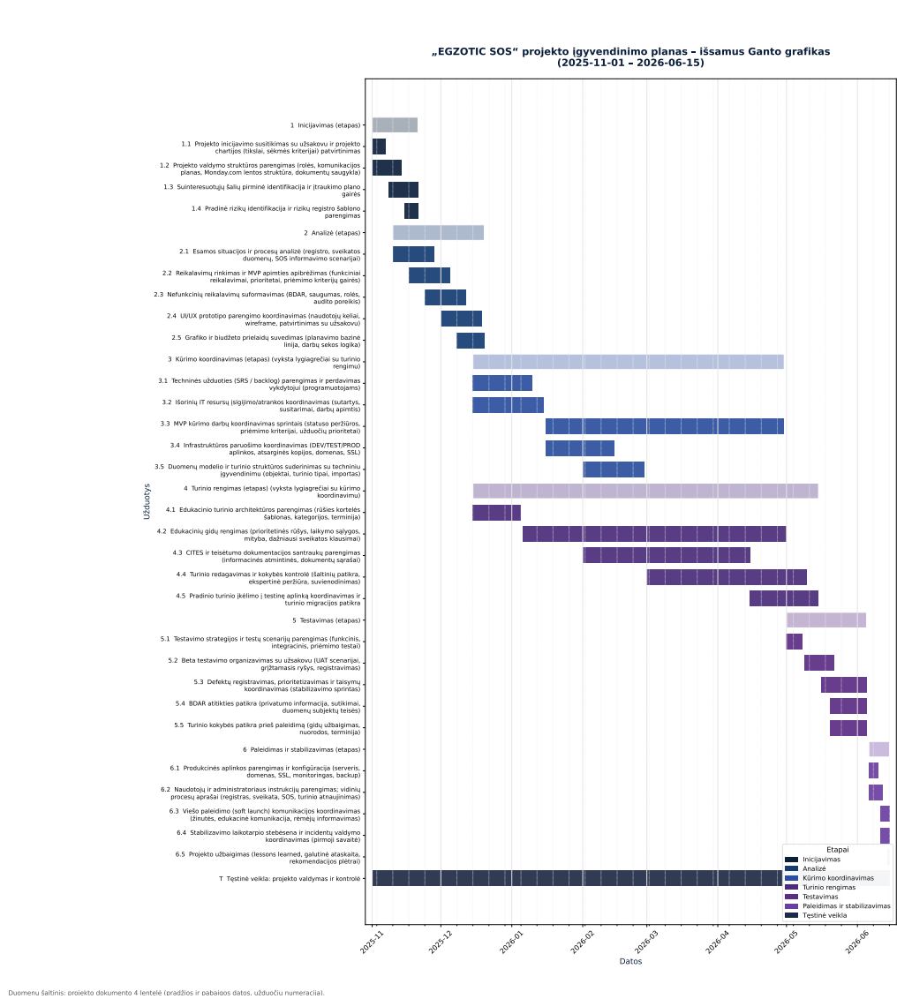

# 👩‍💻 Laura Sulskyte - Digital Marketing Portfolio

Hi there! I'm **Laura Sulskyte**, a passionate Digital Marketing student with management experience and a strong foundation in brand strategy and performance analytics. I combine creativity with data-driven thinking to create impactful campaigns that drive real business results.

---

## 🧠 Skills & Technologies

- Python
- Google ads

---

## 📁 Projects

### 1. 📊 EGZO
**Goal**: I.  
**Tech Stack**: Python  
- Cleaned and explored 6K+ customer records
- Trained multiple ML models with GridSearchCV
- Achieved **89% accuracy** with optimized random forest
- Deployed using Streamlit for demo purposes  
[🔗 View Project](https://github.com/LauraSulskyte/EGZO-Project)

---
## 💼 Professional Experience

**[Company Name], [Location] — [Position]**  
*Time Period*

- Automated classification of healthcare documents using **Python, Tesseract, and Regex**, reducing processing time from 50 mins to 2 mins
- Built BI dashboards in Looker to automate monthly insurance reports, saving ~20 hours per month
- Developed dynamic pricing insights using **time series analysis with BQML**, contributing to a **2% YoY revenue growth**
- Analyzed insurance claims using statistical tests (Chi-square, T-distribution), and cleaned data with Pandas
- Collaborated closely with engineering and business teams using **Agile/Scrum** methodology

---

## 🎓 Education

- Bachelor's in Economics and Statistics | [University Name] | June 2016 – Jan 2020 | GPA: 3.7
- High School., maths | School Name | June 2012 – Jan 2015 | Score: 99%

---

## 🏅 Certifications

- Google ads
- Hubspot

---

## 📬 Let's Connect!

- 📧 Email:  llaurasulskyte@gmail.com 
- 💼 [LinkedIn]()  
- 📂 [Portfolio Website]()  
- 🐙 [GitHub](https://github.com/priyamehta)

---

>  "Marketing is no longer about the stuff that you make, but about the stories you tell." — Seth Godin
